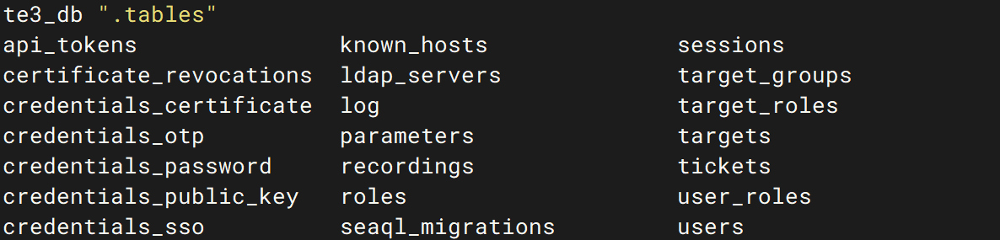

# Warpgate脚本使用说明

# 备份相关
目前已不使用加密备份，直接使用restic备份,分为全量备份和数据库备份。
* 全量备份：每次备份都备份所有文件。
    ```bash
    # 备份所有文件，排除备份数据库目录
    restic backup ./warpgate/ --exclude ./warpgate/backup/ --tag "warpgate-full"
    ```

* 数据库备份：每次备份只备份数据库备份文件。
    ```bash
    # 备份数据库文件
    restic backup ./warpgate/backup/ --tag "warpgate-db-backup"
    ```

* 恢复备份：
    ```bash
    # 恢复所有文件
    restic restore a1b2c3d4 --target /tmp/restore
    ```

* 清理备份
    ```bash
    # 清理最近7天备份
    restic forget --keep-daily 7 --prune

    # 清理后检查仓库完整性
    restic check
    ```

## 加密备份
```bash
sudo bash ./backup_warpgate.sh
```
备份后，还原：
* 先创建还原目录
```bash
mkdir -p /tmp/restore
```
* 解密并解压缩备份文件
```bash
# 替换为你的备份文件路径和密码
openssl enc -aes-256-cbc -salt -pbkdf2 -d -pass pass:你的密码 -in backup/warpgate_backup_20260407_172249.tar.gz | tar -xzf - -C /tmp/restore
```

## 非加密备份
已经使用restic备份，restic自带加密功能，无需加密备份
```bash
restic backup ./warpgate
```

## 数据库备份
```bash
sudo bash ./backup_warpgate_db.sh
```

还原数据库
```bash
# 解压缩数据库备份文件
tar -zxvf 文件名.tar.gz -C /tmp/restore/backup
```

检查数据库是否还原成功
```bash
# 检查数据库备份文件是否完整
sqlite3 /tmp/restore/backup/db_backup_20260407_172249.sqlite3_db ".tables"
```

